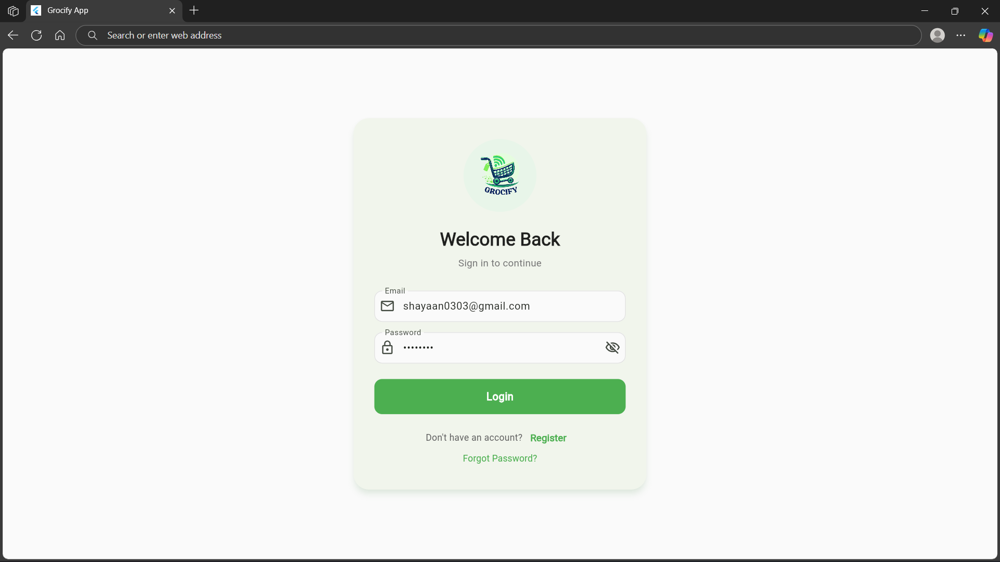
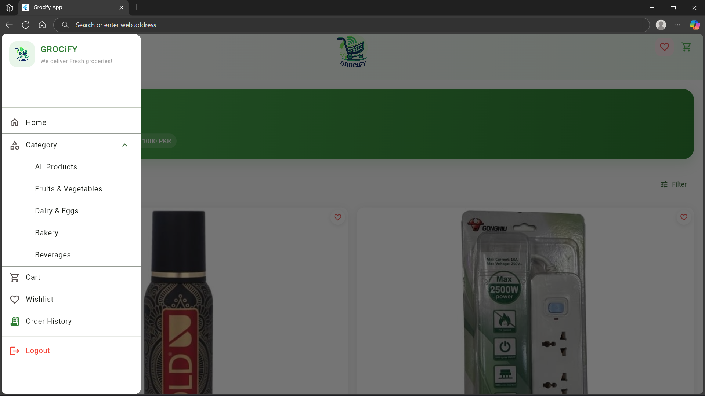

# Grocify (Flutter Grocery App)

A multi-platform grocery shopping app built with **Flutter**, featuring **Wishlist**, **Cart**, **Categories**, **Checkout**, and **Order History** powered by **Firebase** (Firestore + Auth)

> **Note:** Some screens use mock data, and some categories may appear empty if there are no products in Firebase yet

<div style="display: flex; justify-content: center; gap: 16px;">
  
  
</div>

---

## Features

- **Home feed (products from Firestore)**  
  Reads products from the `products` collection in Firestore
- **Categories (drawer-based filter)**  
  Category selection filters the product list; product model includes `category`
- **Wishlist + Cart flows**  
  Home BLoC includes events for wishlist/cart actions + navigation
- **Checkout (currently COD-only) + validation**  
  Requires a logged-in user (Firebase Auth) and validates input/cart before placing an order
- **Order History screen**  
  Order history UI exists and is wired via Firebase/Firestore in the project

---

## Tech Stack

- **Flutter / Dart**
- **BLoC pattern** for feature state management (e.g., HomeBloc, CheckoutBloc)
- **Firebase**
  - **Cloud Firestore** (products + orders/order history)
  - **Firebase Auth** (required for checkout)

---

## Run Locally

### Requirements
- Flutter SDK + platform toolchains installed
- A Firebase project (Firestore + Auth enabled)

### Steps
```bash
git clone https://github.com/hamza-ahmed1/Grocify-Flutter-App.git
cd Grocify-Flutter-App
flutter pub get
flutter run
